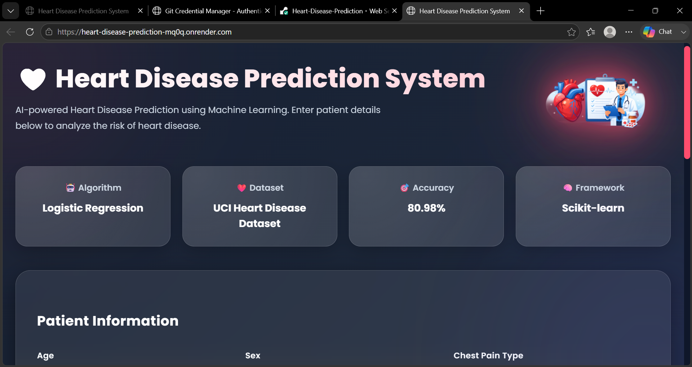
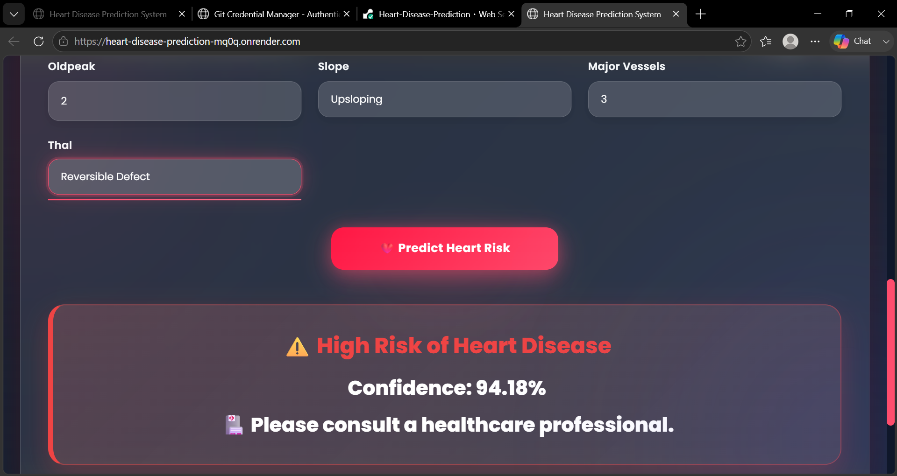

#  Heart Disease Prediction System

A Machine Learning based web application that predicts the risk of heart disease using patient health parameters. The project uses a **Logistic Regression model** integrated with a **Flask web application** to provide real-time predictions through an interactive user interface.

---

##  Live Demo

 Try the application here:

[Live Demo](https://heart-disease-prediction-mq0q.onrender.com)

---

##  Project Overview

Heart disease is one of the leading causes of health complications worldwide. Early prediction can help identify potential risks and support timely medical decisions.

This project uses Machine Learning techniques to analyze medical parameters and predict whether a person is at **Low Risk** or **High Risk** of heart disease.

The trained model is deployed using Flask and connected with a responsive frontend interface.

---

##  Features

-  Heart disease risk prediction
-  Machine Learning based classification
-  Logistic Regression algorithm
-  Flask backend integration
-  Modern responsive user interface
-  Real-time prediction
-  Saved trained model using Joblib
-  Data preprocessing and feature scaling

---

##  Technologies Used

### Machine Learning
- Python
- Pandas
- NumPy
- Scikit-learn
- Logistic Regression
- Joblib

### Backend
- Flask

### Frontend
- HTML5
- CSS3
- JavaScript

### Tools
- VS Code
- Git
- GitHub

---

##  Project Structure

```
HeartDiseasePrediction/
│
├── app.py                 # Flask backend application
├── model.py               # Model training script
├── model.pkl              # Trained machine learning model
├── heart.csv              # Dataset
├── requirements.txt       # Required libraries
│
├── templates/
│   └── index.html         # Frontend page
│
├── static/
│   └── style.css          # Styling file
│
├── screenshots/
│   ├── home.png           # Application homepage
│   └── result.png         # Prediction output
│
└── README.md              # Project documentation
```

---

##  Dataset

The model is trained using a heart disease dataset containing medical attributes:

| Feature | Description |
|---|---|
| Age | Patient age |
| Sex | Gender |
| Chest Pain Type | Type of chest pain |
| Resting Blood Pressure | Blood pressure value |
| Cholesterol | Cholesterol level |
| Fasting Blood Sugar | Blood sugar information |
| Rest ECG | ECG results |
| Maximum Heart Rate | Maximum achieved heart rate |
| Exercise Angina | Exercise induced chest pain |
| Oldpeak | ST depression |
| Slope | ST segment slope |
| Major Vessels | Number of major vessels |
| Thal | Thalassemia |
| Target | Heart disease result |

---

#  Installation & Setup

## 1. Clone Repository

```bash
git clone YOUR_GITHUB_LINK
```

## 2. Navigate to Project Folder

```bash
cd HeartDiseasePrediction
```

## 3. Create Virtual Environment

```bash
python -m venv .venv
```

Activate environment:

### Windows

```bash
.venv\Scripts\activate
```

---

## 4. Install Dependencies

```bash
pip install -r requirements.txt
```

---

## 5. Train the Model

Run:

```bash
python model.py
```

This will generate:

```
model.pkl
```

---

## 6. Run Flask Application

Start the application:

```bash
python app.py
```

Open in browser:

```
http://127.0.0.1:5000
```

---

#  Machine Learning Model

## Algorithm Used

**Logistic Regression**

## Why Logistic Regression?

- Suitable for binary classification problems
- Simple and efficient algorithm
- Works well with medical datasets
- Provides fast predictions

---

#  Project Workflow

```
Dataset
   ↓
Data Preprocessing
   ↓
Feature Scaling
   ↓
Train-Test Split
   ↓
Logistic Regression Training
   ↓
Model Evaluation
   ↓
Save Model (model.pkl)
   ↓
Flask Integration
   ↓
User Prediction
```

---

#  Screenshots

## 🏠 Home Page




##  Prediction Result



---

#  Model Performance

The model performance is evaluated using:

- Accuracy Score
- Classification Report

Accuracy:

```
80.98%
```

---

#  Future Improvements

- Compare multiple machine learning algorithms
- Improve model accuracy
- Add prediction probability percentage
- Add patient history tracking
- Deploy with cloud platforms
- Add visualization charts

---

# 🔗 Links

## GitHub Repository

https://github.com/sshreya2311/Heart-Disease-Prediction.git

## Live Application

https://heart-disease-prediction-mq0q.onrender.com

---
#  Acknowledgements

- Scikit-learn Documentation
- Flask Documentation
- Open-source Heart Disease Dataset

---

